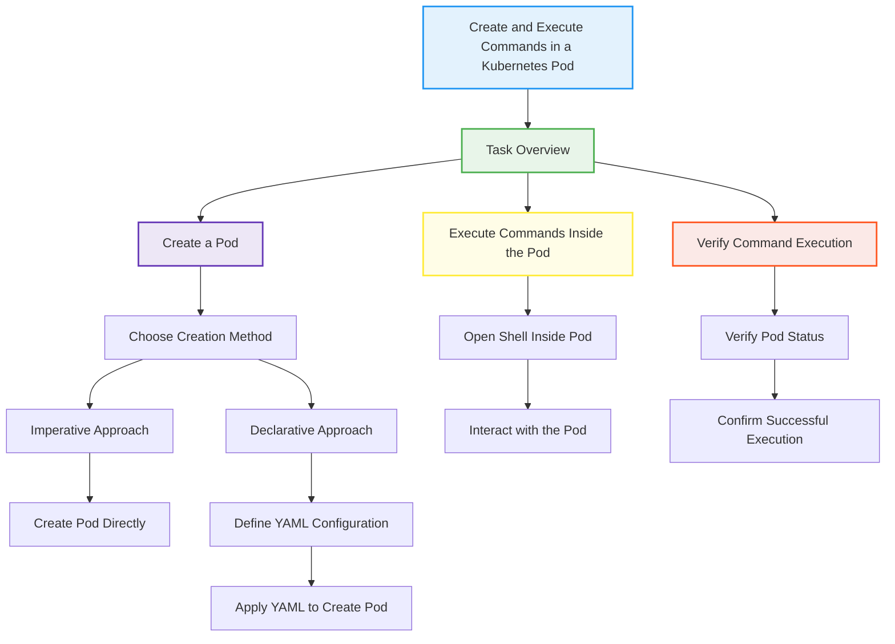

# 🚀 Kubernetes Pod Command Management

[](https://github.com/TheToriqul/k8s-pod-commands)
[](https://github.com/TheToriqul/k8s-pod-commands/stargazers)


## 📋 Overview

This repository documents my journey learning Kubernetes pod management, focusing on creating and executing commands within pods. Through hands-on practice, I've developed practical skills in both imperative and declarative approaches to pod management, essential for modern container orchestration.

## 🏗 Technical Architecture

The project demonstrates a fundamental Kubernetes setup focusing on pod-level operations:



## 💻 Technical Stack

- **Container Runtime**: Docker
- **Container Image**: nginx:latest
- **Orchestration**: Kubernetes
- **CLI Tools**: kubectl
- **Configuration**: YAML

## ⭐ Key Features

1. Pod Creation and Management
   - Imperative pod creation
   - Declarative YAML-based deployment
   - Pod lifecycle management

2. Container Execution
   - Interactive shell access
   - Command execution
   - Process inspection

3. Configuration Management
   - Port configuration
   - Container specifications
   - Resource definitions

4. Operational Verification
   - Status checking
   - Health monitoring
   - Version verification

## 📚 Learning Journey

### Technical Mastery:

1. Kubernetes Pod Architecture
2. Container Lifecycle Management
3. YAML Configuration Structure
4. kubectl Command Operations
5. Interactive Debugging Techniques

### Professional Development:

1. Infrastructure as Code Practices
2. Documentation Skills
3. Problem-solving Methodology
4. DevOps Best Practices
5. System Architecture Understanding

## 🔄 Future Enhancements

<details>
<summary>View Planned Improvements</summary>

1. Multi-container Pod Configurations
2. Custom Health Checks Implementation
3. Resource Limits Management
4. Network Policy Integration
5. Service Discovery Implementation
6. Persistent Storage Integration
</details>

## ⚙️ Installation

<details>
<summary>View Installation Details</summary>

### Prerequisites

- Kubernetes cluster (local or cloud)
- kubectl CLI tool
- Docker Desktop (for local development)

### Setup Steps

1. Clone the repository:
```bash
git clone https://github.com/TheToriqul/k8s-pod-commands.git
```

2. Navigate to the project directory:
```bash
cd k8s-pod-commands
```

3. Apply the pod configuration:
```bash
kubectl apply -f my-pod.yaml
```

</details>

## 📫 Contact

- 📧 Email: toriqul.int@gmail.com
- 📱 Phone: +65 8936 7705, +8801765 939006

## 🔗 Project Links

- [GitHub Repository](https://github.com/TheToriqul/k8s-pod-commands)

## 👏 Acknowledgments

- [Poridhi for excellent labs](https://poridhi.io/)
- Kubernetes Community
- CNCF Documentation

Feel free to explore, modify, and build upon this configuration as part of my learning journey. You're also welcome to learn from it, and I wish you the best of luck!